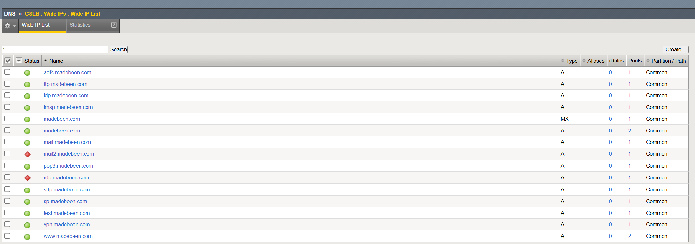
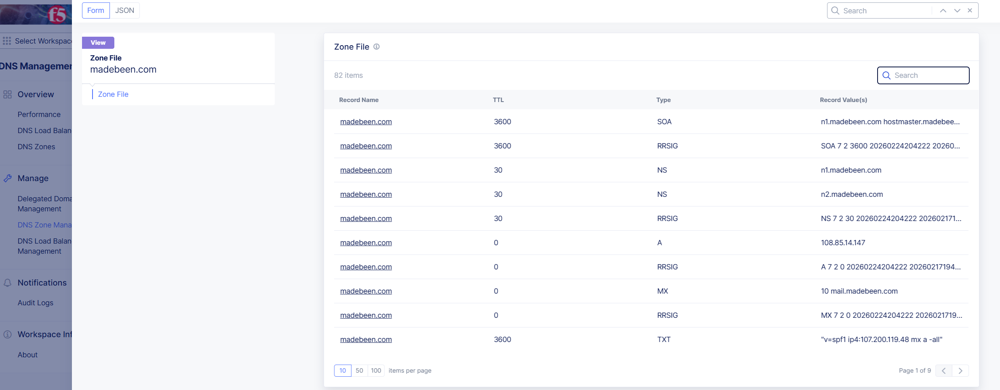

# 🌐 Enterprise Secondary XC DNS Architecture

## F5 BIG-IP DNS Primary (GTM)


------------------------------------------------------------------------

# 🧭 Overview

This repository provides an **enterprise-grade deployment pattern** for
implementing:

✅ Primary authoritative DNS using F5 BIGIP DNS\
✅ Secondary DNS zone using F5 XC DNS\
✅ Hidden primary architecture\
✅ Intelligent DNS traffic steering\
✅ High availability and resilient DNS infrastructure

This follows senior-level architecture principles where DNS becomes a
**traffic decision layer** rather than simple name resolution.

------------------------------------------------------------------------

# 🔥 Why This Architecture Exists

Traditional secondary DNS:

    Primary DNS  --->  Secondary DNS  --->  Clients

Enterprise BIG-IP DNS:

    Resolver Query
          |
          v
    +--------------------------+
    |       BIG-IP DNS          |
    |  Policy + Health Engine   |
    +-------------+------------+
                  |
         Intelligent endpoint selection

Benefits:

-   Application-aware DNS
-   Health-based failover
-   Geo/topology steering
-   Enterprise-grade resiliency

------------------------------------------------------------------------

# 🏗 Architecture Diagram (ASCII)

                             INTERNET
                                 |
                       Authoritative Queries
                                 |
              +-----------------------------------------+
              |              BIG-IP DNS                |
              |   Secondary Authoritative + GTM Logic |
              +------------------+--------------------+
                                 |
                           AXFR / IXFR
                                 |
                   +------------------------------+
                   |        Hidden Primary         |
                   |     Internal Authoritative    |
                   +------------------------------+

------------------------------------------------------------------------

# 🧠 BIG-IP Object Hierarchy

    Datacenter
       |
       +-- Server
               |
               +-- Virtual Server
                        |
                        +-- WideIP
                               |
                               +-- DNS Response Logic

This hierarchy enables:

-   Health propagation
-   Intelligent routing decisions
-   Centralized policy management

------------------------------------------------------------------------

# 🚀 Enterprise Deployment Workflow

## 1️⃣ Prepare Primary DNS

Enable zone transfer:
1. Adjust named.conf file to Allow Transfer as follows:
```
    allow-transfer {
        <bigip_dns_ip>;
        localhost;
        F5-Cloud;
    };
```
2. The <F5-Cloud> is an ACL for the following IP addresses:
```
acl "F5-Cloud" {
     52.14.213.208/32;
     3.140.118.214/32;
};
```
3. If there is a zone label < . > - this should be removed:
```
zone "." {
     type master;
     file "db.external.example.com";
     allow-update {
     127.0.0.1;
     localhost;
};
```
4. Verify the file named tsig.key in the /var/named/config directory exists, and the configuration syntax is correct:
```
key "<key_name>" {
     algorithm <hash_alg>;
     secret "<secret>";
};
```

5. Include <key_name>, and remember to use the same name as it is case sensitive: 
```
zone "example.com." {
        type master;
        file "db.external.example.";
        allow-update {
            localhost;
        };
        allow-transfer {
            key <key_name>;
            localhost;
        };
    };
```

6. Make sure that the zone transfer works correctly, by performing a local AXFR from the BIG-IP, with the below command:
```
dig +norecurse AXFR @localhost <zone-name> -y <tsig-algorithm>:tsig-key:<secret>
```    
   
Recommended:

-   ACL restrictions
-   TSIG authentication
-   Hidden primary design

------------------------------------------------------------------------

## 2️⃣ Configure Secondary Zone (ZoneRunner)

Navigate:

    DNS → Zones → ZoneRunner

Parameters:

-   Zone Type: Primary
-   Primary server IP
-   Enable NOTIFY if available

------------------------------------------------------------------------

## 3️⃣ DNS Listener Architecture

Design principles:

-   Dedicated DNS VLAN
-   HA sync-failover pair
-   TCP + UDP 53 enabled

------------------------------------------------------------------------

# 🔐 Secure Zone Transfers (TSIG)

    key "dns-transfer-key" {
        algorithm hmac-sha256;
        secret "SECRET";
    };

Goals:

-   Prevent unauthorized transfers
-   Protect internal zone data

------------------------------------------------------------------------

# 🌍 Hidden Primary Pattern

    +-------------------+
    |   Hidden Primary  |
    |   Internal Only   |
    +---------+---------+
              |
              v
    +--------------------------+
    |       BIG-IP DNS          |
    |   Public Authoritative    |
    +------------+-------------+
                 |
              Internet

Benefits:

-   Reduced attack surface
-   Controlled updates
-   Improved security posture

------------------------------------------------------------------------

# 🚦 DNS Decision Flow (ASCII)

    Client Resolver
          |
          v
    Receive DNS Query
          |
    Evaluate WideIP Policy
          |
    Check Health Monitors
          |
    Apply Geo/Topology Rules
          |
    Return Optimized Answer

------------------------------------------------------------------------

# ⚡ Performance Engineering

Recommended practices:

-   Use IXFR for incremental updates
-   Optimize TTL values
-   Monitor query-per-second metrics
-   Consider DNS Express acceleration

------------------------------------------------------------------------

# 🧪 Validation Commands

    dig AXFR @localhost madebeen..com
    dig @<bigip_ip> www.madebeen..com
    dig SOA madebeen..com

------------------------------------------------------------------------

# 🧱 Enterprise Pitfalls

  Problem             Root Cause
  ------------------- ----------------------------------
  Zone not syncing    allow-transfer missing
  Transfer refused    TSIG mismatch
  Incorrect routing   Health monitor missing
  Slow response       TTL or topology misconfiguration

------------------------------------------------------------------------

# 📈 Validating Secondary DNS (Distributed Cloud XC)

-   The following screenshot on your XC tenant confirms that synchornization is occurring sucessfully between F5's BIGIP GTM and XC DNS. 



------------------------------------------------------------------------


## License

This project is intended for operational automation within F5 environments.  
Use at your own risk and validate in a test environment prior to production deployment.

------------------------------------------------------------------------

## 🧾 References & Resources
```
https://my.f5.com/manage/s/article/K000147071
https://my.f5.com/manage/s/article/K000147843
https://my.f5.com/manage/s/article/K000146739

```

------------------------------------------------------------------------

# 🤝 Contributing

Pull requests welcome:

-   Automation examples
-   Architecture diagrams
-   Policy templates

------------------------------------------------------------------------

# ⭐ Credits

Architecture based on enterprise F5 BIG-IP DNS deployment patterns and
real-world designs.

------------------------------------------------------------------------

## 🧑‍💻 Author
**Marlon Frank**  
*Network and Application Security & F5 Automation Engineer*  
